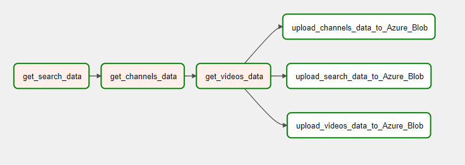

# Youtube channels analysis

## Description
This project's goal is to analyze statistics of the most popular channels about Data Engineering and find a pattern that led their creators to success.

### What do you need to run this project
- Docker (only if using Windows)
- Google Account
- Airflow
- Azure Subscription:
  - Azure Storage Account
  - Azure Data Factory
  - Databricks

### Design

First step of this project will be extracting youtube data. This part will be performed by Airflow DAG. Using Youtube Data API I will collect the data about top search results for the phrase *Data Engineering* of the channel type.
In next step I will extract statistics of this channels, and finally statistics of the last *N* videos uploaded by their owners.

Search results, channels and videos statistics will be then uploaded to Azure Blob Storage.

Nex step will be copying the data from landing place to Bronze layer directory in the same Storage Account. This will be performed by Azure Data Factory Pipeline. The data copying will be executed incrementally with separate watermarks for search, channels and videos data.

Processing data and structurizing them will be performed by Databricks notebook. Such data will be saved in Silver layer directory.

Aggregating data will be also performed by Databricks notebook. Such data will be saved in Gold layer directory.

Both Databricks notebook will be executed by Azure Data Factory pipeline after copying data to Bronze Layer Directory.

More technical Details will be covered in dedicated sections of this Readme file.

## Initial Preparation 
### Setup Airflow on Docker
>If you are using linux, you don't have to use Docker. Instead you can just create virtual environment and install airflow via pip.

To setup airflow on Docker please follow these steps: https://airflow.apache.org/docs/apache-airflow/stable/howto/docker-compose/index.html

TL;DR:

```
curl -LfO 'https://airflow.apache.org/docs/apache-airflow/2.7.0/docker-compose.yaml'
mkdir -p ./dags ./logs ./plugins ./config
docker compose up airflow-init
docker compose up --build
```

### Setup YouTube Data API KEY
In order to use Youtube Data API you have to follow these steps: https://developers.google.com/youtube/v3/getting-started?hl=pl


## Airflow
### Airflow Vairbles and Connections

### Airflow DAG
Airflow DAG should be created in `airflow-local/dags` directory which is mounted in the container (synchronized between computer and container).

>You can find DAG created for this task here: [yt-data-DAG](airflow-local/dags/yt-api.py)

DAG created for this project consists of 6 steps:


Steps get_search_data, get_channels_data and get_videos data are run sequentially becouse they depend on outputs of the previous one (To search channels data we have to fetch search data earlier).
Steps uploading data to Azure Blob Storage are run in parallel - they upload data fetched by all the previous steps.

This DAG is scheduled to run daily.

## Azure Data Factory Pipeline
### Linked Service and Datasets
We need two Linked Services. One of Storage type and one of Compute type.

Storage type Linked Service should point to Storage Account. I chose authentication via Account Key, but you can choose any type you want.

Compute type Linked Service should point to Databricks Workspace. I chose authentication via Access token. You can generate it in you Databricks workspace as described here:
https://docs.databricks.com/en/dev-tools/auth.html#databricks-personal-access-tokens-for-workspace-users.
You can also choose any other type of authentication.

### Pipelines

### Data Flow

## Databricks
### Create secrets
In order to read data from Azure Storage we have to create a secret containing access key. To manage secrets in Databricks you can use Databricks CLI: https://docs.databricks.com/en/dev-tools/cli/databricks-cli.html

To setup secret type following commands: 
```
databricks secrets create-scope <scope-name>
databricks secrets put-secret <scope-name> <secret-name> --string-value "<access-key-to-storage-account>"
```

To read secret in datbricks run:
```
dbutils.secrets.get(scope=<scope-key>, key=<secret-name>)
```


