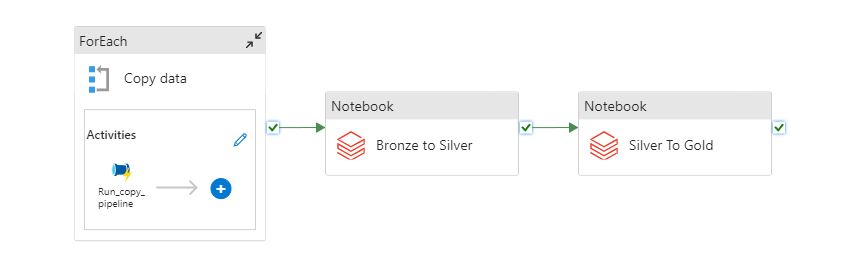
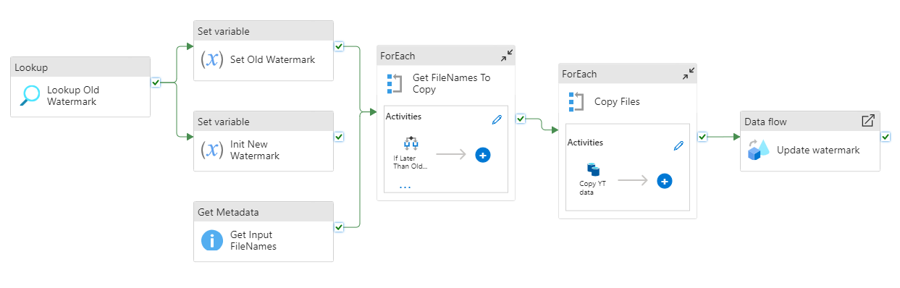
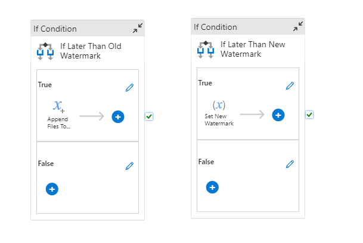
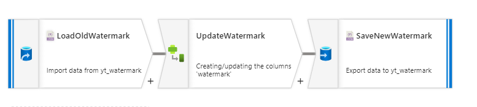
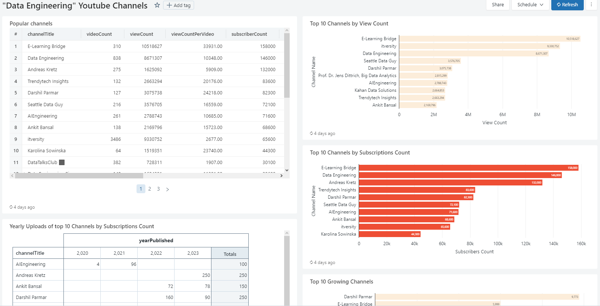
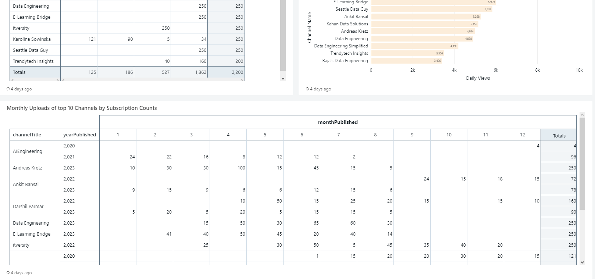

# Youtube channels analysis

## Description
This project's goal is to analyze statistics of the most popular channels about Data Engineering and find a pattern that led their creators to success.

### What do you need to run this project
- Docker (only if using Windows)
- Google Account
- Airflow
- Azure Subscription:
  - Azure Storage Account
  - Azure Data Factory
  - Databricks

### Design

First step of this project will be extracting youtube data. This part will be performed by Airflow DAG. Using Youtube Data API I will collect the data about top search results for the phrase *Data Engineering* of the channel type.
In next step I will extract statistics of this channels, and finally statistics of the last *N* videos uploaded by their owners.

Search results, channels and videos statistics will be then uploaded to Azure Blob Storage.

Nex step will be copying the data from landing place to Bronze layer directory in the same Storage Account. This will be performed by Azure Data Factory Pipeline. The data copying will be executed incrementally with separate watermarks for search, channels and videos data.

Processing data and structurizing them will be performed by Databricks notebook. Such data will be saved in Silver layer directory.

Aggregating data will be also performed by Databricks notebook. Such data will be saved in Gold layer directory.

Both Databricks notebook will be executed by Azure Data Factory pipeline after copying data to Bronze Layer Directory.

More technical Details will be covered in dedicated sections of this Readme file.

## Initial Preparation 
### Setup Airflow on Docker
>If you are using linux, you don't have to use Docker. Instead you can just create virtual environment and install airflow via pip.

To setup airflow on Docker please follow these steps: https://airflow.apache.org/docs/apache-airflow/stable/howto/docker-compose/index.html

TL;DR:

```
curl -LfO 'https://airflow.apache.org/docs/apache-airflow/2.7.0/docker-compose.yaml'
mkdir -p ./dags ./logs ./plugins ./config
docker compose up airflow-init
docker compose up --build
```

### Setup YouTube Data API KEY
In order to use Youtube Data API you have to follow these steps: https://developers.google.com/youtube/v3/getting-started?hl=pl

## Azure Storage Account
In my Storage Account i have container named `mol`. Inside this container I've created two directories `yt-data` which is a landing directory for raw data, and `yt-analysis-data` which is directory for Bronze-Silver-Gold layers.

Directory tree in my container is as follows:
```
├── yt-data
  ├── search
    └── watermark.json
  ├── channels
    └── watermark.json
  └── videos
    └── watermark.json
└── yt-analysis-data
  ├── bronze
  ├── silver
  └── gold
```

As you can see in directories `search`, `channels` and `videos` there is also a file `watermark.json` added. Initially it should be:
```
{"watermark":"1970-01-01"}
```
Later the watermarks date will be overwritten by ADF pipeline.

## Airflow
### Airflow Vairbles and Connections
In order to connect with Youtube Data API and with Azure Blob Storage you have to store your credentials in Airflow. They should be kept as secret.

Youtube Data API key is stored as a variable. It can be created in Airflow UI in `Admin >> Variables` section. I named this variable `YT_KEY`.

Storage Account credentials are stored as a connection in Airflow. Connection can be created in Airflow UI in `Admin >> Connections` section. You have to choose one of many authentication methods. I used Blob Storage Connection String. I named my connection `azure-sa`.

### Airflow DAG
Airflow DAG should be created in `airflow-local/dags` directory which is mounted in the container (synchronized between computer and container).

>You can find DAG created for this task here: [yt-data-DAG](airflow-local/dags/yt-api.py)

DAG created for this project consists of 6 steps:


Steps get_search_data, get_channels_data and get_videos data are run sequentially becouse they depend on outputs of the previous one (To search channels data we have to fetch search data earlier).
Steps uploading data to Azure Blob Storage are run in parallel - they upload data fetched by all the previous steps.

This DAG is scheduled to run daily.

## Azure Data Factory Pipeline
### Linked Service
We need two Linked Services. One of Storage type and one of Compute type.

Storage type Linked Service should point to Storage Account. I chose authentication via Account Key, but you can choose any type you want.

Compute type Linked Service should point to Databricks Workspace. I chose authentication via Access token. You can generate it in you Databricks workspace as described here:
https://docs.databricks.com/en/dev-tools/auth.html#databricks-personal-access-tokens-for-workspace-users.
You can also choose any other type of authentication.

### Datasets
In the landing directory we have three separate directories (for search data, channels data and videos data).
We don't have to create three separate datasets in ADF, we can create one and parametrize them.
>Actually we have to create two datasets - one for directories (used to list all files) and one for files inside them (used to copy specific file)

Let's create following datasets:
* yt_input_directory
  * Parameters: directory (string)
  * File path: `<container_name>` / `@concat('yt-data/', dataset().directory)` / ` `
* yt_input_file
  * parameters: directory (string), filename (string)
  * File path: `<container_name>` / `@concat('yt-data/', dataset().directory)` / `@dataset().filename `
* yt_watermak
  * parameters: directory (string)
  * File path: `<container_name>` / `@concat('yt-data/', dataset().directory)` / `watermark.json `
* yt_output_data
  * parameters: filename (string)
  * File path: `<container_name>` / `yt-analysis-data/bronze` / `@dataset().filename`


### Pipelines
#### Main Pipeline
Main pipeline has one parameter - `directories` of type Array with default value - `["search","channels","videos"]`.



First action of the main pipeline is iterating over elements of `directories` param and running copy_data pipeline for search, channels and videos data. This pipeline is described in details in text section.

After copying data there are executed Databricks notebooks. First is notebook responsible for flattening bronze data, dedeuping them, casting correct column types and saving to silver layer directory. Second notebook is responsible for calculating aggregates and saving them in gold layer directory. Databricks notebooks are described in details in "Databricks" section.

#### Copy Data Pipeline
Copy Data pipeline has one parameter and three variables.

Parameters:
  * directory (String) - no default value

Variables:
  * old_watermark (String) - no default value
  * new_watermark (String) - no default value
  * files_to_copy (Array) - no default value



Activities:
  * **Lookup Old Watermark** - Reads the value of current watermark in specific directory ("search", "channels", "videos").
    * As Source dataset uses `yt_watermark` and passes value of pipeline directory param into dataset directory param.
  *  **Set Old Watermark** - assigns the value read by `Lookup Old Watermark` to variable `old_watermark`
     *  Value is `@activity('Lookup Old Watermark').output.firstRow.watermark`
  *  **Init New Watermark** - initializes variable `new_watermark` with the value read by `Lookup Old Watermark`
     *  Value is `@activity('Lookup Old Watermark').output.firstRow.watermark`
  *  **Get Input FileNames** - gets the names of every file in directory.
     *  As Source dataset uses `yt_input_directory` and passes value of pipeline directory param into dataset directory param.
     *  Field list param is set to "Child items"
 * **Get Filenames To Copy** - For each value returned by `Get Input FileNames`:

   * **If Later than Old Watermark** - appends files that are older that watermark value and that are not watermark itself to variable `files_to_copy`. Appended value is ``
   *  **If Later Than New Watermark** - Sets a value of `new_watermark`. Set value is
```
# If Later than Old Watermark condition:

@if(
  greater(length(split(item().name, '-')), 2),
    greater(
      ticks(formatDateTime(
        join(take(skip(split(item().name, '-'), 3), 3), '-'), 'yyyy-MM-dd')), 
      ticks(formatDateTime(variables('old_watermark'), 'yyyy-MM-dd'))),
  bool(0)
)

# If Later than Old Watermark appended value:

@item().name
```
```
If Later Than New Watermark condition:

@if(
  greater(length(split(item().name, '-')), 2),
  greater(
    ticks(formatDateTime(
      join(take(skip(split(item().name, '-'), 3), 3), '-'), 'yyyy-MM-dd')),
    ticks(formatDateTime(variables('new_watermark'), 'yyyy-MM-dd'))),
bool(0)
)

If Later Than New Watermark set value:

@formatDateTime(join(take(skip(split(item().name, '-'), 3), 3), '-'), 'yyyy-MM-dd')
```
  
* **Copy Files** - iterates over variable `files_to_copy` and copies file to Bronze Layer directory.
  * As source dataset uses `yt_input_file` with params:
    * directory = `@pipeline().parameters.directory`
    * filename = `@item()`
  * As sink dataset uses `yt_output_data` with param:
    * `filename` = `@concat(join(take(split(item(), '-'), 6), '-'),'.json')`

* **Update watermark** - Runs dataflow `Update_watermark` that updates `watermark.json` file in current directory. It is described in details in next section.

### Data Flow
#### Update watermark dataflow
This data flow updates `watermark.json` file with new value of watermark. 

This Data flow has one parameter:
* new_watermark (String) - no default value



Steps:
* **LoadOldWatermark** - Source - Loads watermark file.
  * Source dataset = `yt_watermark`
* **Update Watermark** - Derived Column - Changes value of watermark.
  * Set value = `$new_watermark`
* **SaveNewWatermark** - Sink - Saves new watermark to file.
  * Sink dataset = `yt_watermark`


### Trigger
There is a schedule type trigger created that runs everyday at midnight.

## Databricks
### Secrets
In order to read data from Azure Storage we have to create a secret containing access key. To manage secrets in Databricks you can use Databricks CLI: https://docs.databricks.com/en/dev-tools/cli/databricks-cli.html

To setup secret type following commands: 
```
databricks secrets create-scope <scope-name>
databricks secrets put-secret <scope-name> <secret-name> --string-value "<access-key-to-storage-account>"
```

To read secret in datbricks run:
```
dbutils.secrets.get(scope=<scope-key>, key=<secret-name>)
```

### Notebooks
#### Bronze to Silver
This notebook's purpose is mainly to flatten JSONs files into tables. It also deduplicates tables and casts correct column datatypes.

Such preprocessed data are then saves as .parquets into Silver Layer directory in Storage Account.

>You can find this notebook here: [bronze-to-silver-notebook](databricks/Structurize%20YT%20Data%20(Bronze%20to%20Silver%20Layer).py)

#### Silver to Gold
In this notebook there are calulated aggregates. 

First of them is "Most popular channels". It joins channels_df with search_df, then chooses only most recently acquired data and creates column "viewCountPerVideo".

Second one is "Growing Channels". It calculates daily viewCount considering only two most recents data acquisition dates. Data are also sorted by daily views.

Another two aggregates are "Monthly uploads" and "Weekly uploads". There are added columns related to year, month and week of vidoes publishing, then data are grouped by this columns and the count of videos in these periods is calulcated.

Output dataframes are saved as parquets into Gold Layer directory. There are also converted to Delta Tables and stored in database in the Gold Layer directory. Thanks to that I can create dashboard using SQL in Databricks. That is described in the next section.

>You can find this notebook here: [silver-to-gold-notebook](databricks/Aggregates%20(Silver%20to%20Gold%20Layer).py)

### Dashboard

Using SQL Warehous in Databricks I created a Dashboard to visualize the outcome of my analysis.



